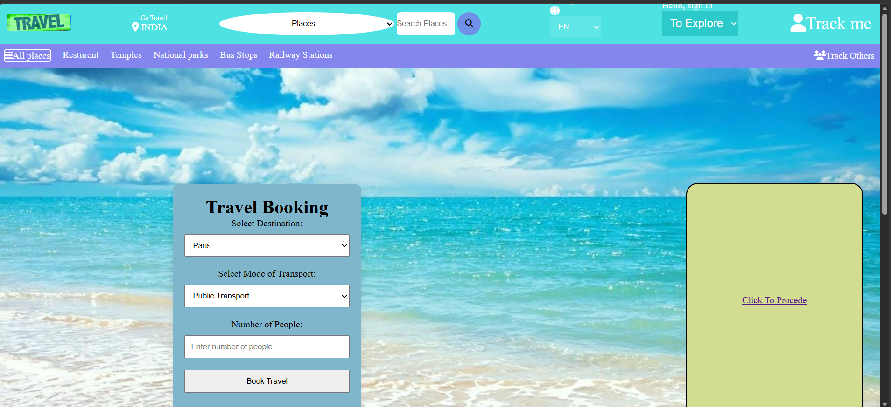
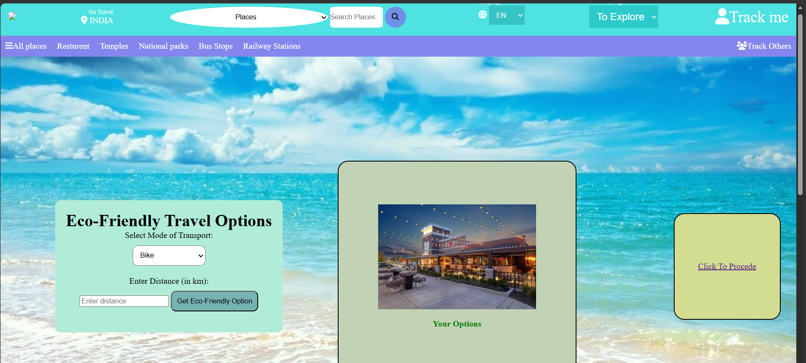

<<<<<<< HEAD
# Hackathon_sept
=======
# Go Travel Hackathon Project

This project is a small multi-page travel web app prototype with basic sustainability-focused trip planning ideas.

## Website Concept

Go Travel is a concept website focused on **smart and eco-friendly travel planning**.
The user journey is designed as a simple 3-step flow:

1. Book a trip destination and travel mode.
2. Explore eco-friendly transport choices.
3. Discover sustainable stay and chill-out activity suggestions.

The main idea is to encourage travelers to make better environmental choices while planning a convenient trip.

## Website Preview

Below is a `.png` image used as a visual preview of the website look:



You can also try this alternate logo/preview image:



## Project Files

- `index.html` - Home page (entry point) with navigation to all pages.
- `page_1.html` - Travel booking page.
- `page_2.html` - Eco-friendly transport suggestion page.
- `page_3.html` - Eco-friendly accommodation suggestion page.
- `main.css` - Shared styles used by the web pages.
- `main.py` - Simple voice assistant prototype using speech recognition and text-to-speech (Windows).
- `main2.py` - Basic Python test script.

## Features

- Multi-page travel flow.
- Booking form UI on page 1.
- Eco transport suggestions on page 2.
- Eco accommodation suggestions on page 3.
- Shared header/footer styling.

## How To Run (Website)

1. Open this folder in VS Code.
2. Open `index.html` in a browser.
3. For best navigation behavior, run with a local server (for example VS Code Live Server).

### Using VS Code Live Server

1. Install the "Live Server" extension.
2. Right-click `index.html`.
3. Click **Open with Live Server**.

## How To Run (Python Files)

### `main.py`

This file needs Python and extra packages:

```bash
pip install SpeechRecognition pyaudio pywin32
```

Then run:

```bash
python main.py
```

Notes:
- This script is Windows-focused because it uses SAPI voice (`win32com.client`).
- A microphone is required.

### `main2.py`

```bash
python main2.py
```

## Current Limitations / Notes

- Some links inside pages currently point to `http://127.0.0.1:5500/...` and assume a local dev server.
- A few JavaScript/HTML parts in the existing pages may need cleanup for production use.
- Some image files referenced in HTML/CSS must exist in the same folder to display properly.

## Suggested Next Improvements

1. Replace absolute localhost links with relative links.
2. Validate and refine HTML structure (custom tags like `<h>`, `<hb>`, etc.).
3. Improve form validation and user feedback.
4. Add a consistent mobile-first layout.
5. Add error handling for Python voice input.
>>>>>>> 0005ea0 (Initial commit)
